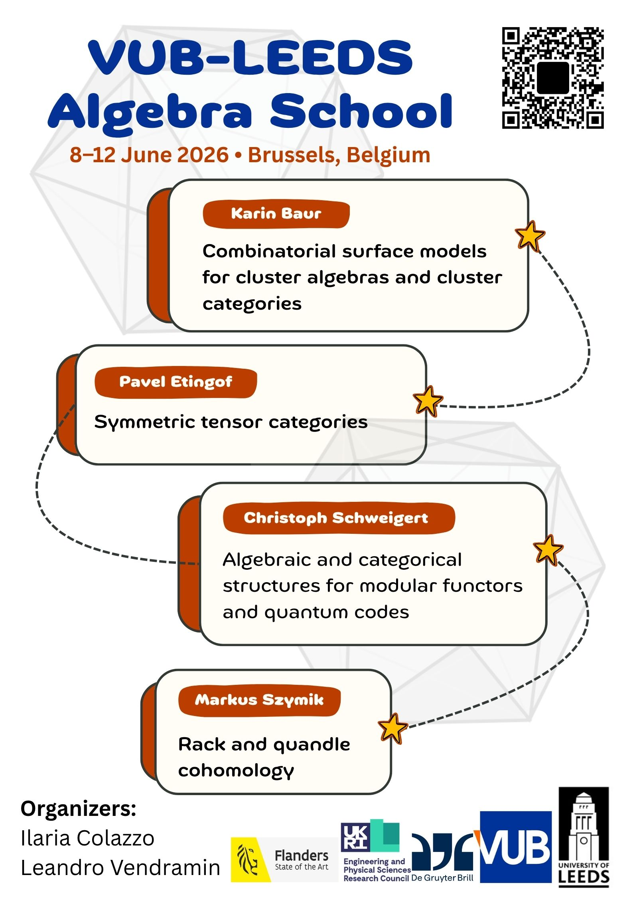

<section class="hero">
  <h2>Overview</h2>
  

    A training week for MSc students, PhD students, postdocs, and researchers,
    featuring four mini-courses and a poster session.
  

  

    4 mini-courses
    Poster session
    Networking
  

  

    <!-- <a class="button" href="registration.html">Registration</a> -->
    <a class="button" href="programme.html">View programme</a>
    <a class="button secondary" href="schedule.html">View schedule</a>
  

</section>

<section class="hero">
<h2>Announcement</h2>
Slides, exercises, and other course materials are available on the Programme page, where they are linked under the corresponding speakers and lectures.
</section>

<section>
  <h2>Poster</h2>
  

    
    

      <a class="button secondary" href="img/poster.pdf" download>Download printable poster (PDF)</a>
    

  

</section>

<section>
  <h2>Key information</h2>
  

    
Dates

8–12 June 2026.

    
City

Brussels, Belgium.

    
Venue

LIC.0.04 Learning Theatre - Etterbeek Campus.

    
Audience

MSc / PhD / Postdoc / Researchers. 

    
Format

Four mini-courses + poster session.

    
Fees

<strong>Registration is now closed</strong>. 

  

</section>

<section>
  <h2>Mini-courses</h2>
  

    

      <h3>Combinatorial surface models for cluster algebras and cluster categories
</h3>
      
<strong>Instructor:</strong> Karin Baur  (<em>Ruhr-Universität Bochum & University of Leeds</em>)

    

    

      <h3>Symmetric tensor categories</h3>
      
<strong>Instructor:</strong> Pavel Etingof  (<em>Massachusetts Institute of Technology</em>)

    

    

      <h3>Algebraic and categorical structures for modular functors and
quantum codes</h3>
      
<strong>Instructor:</strong> Christoph Schweigert  (<em>Hamburg University</em>)

    

    

      <h3>Homology of racks and quandles</h3>
      
<strong>Instructor:</strong> Markus Szymik  (<em>University of Sheffield</em>)

    

  

</section>

<section>
<h2>Conference picture</h2>
  

    
    

      <a class="button secondary" href="img/poster.pdf" download>Download printable poster (PDF)</a>
    

  

</section>

<section>
  <h2>Code of conduct</h2>
  

    We are committed to providing a welcoming, respectful, and inclusive environment for all participants,
    regardless of background or identity. Please treat others with courtesy and professionalism, and respect
    different viewpoints and experiences. Harassment, discrimination, intimidation, or disruptive behavior
    are not tolerated.
  

  

    If you experience or witness a concern, please contact the organisers (details on the <a href="organisers.html">Organisers</a> page).
    Issues will be handled promptly and, when necessary, participants may be asked to leave the event.
  

</section>
