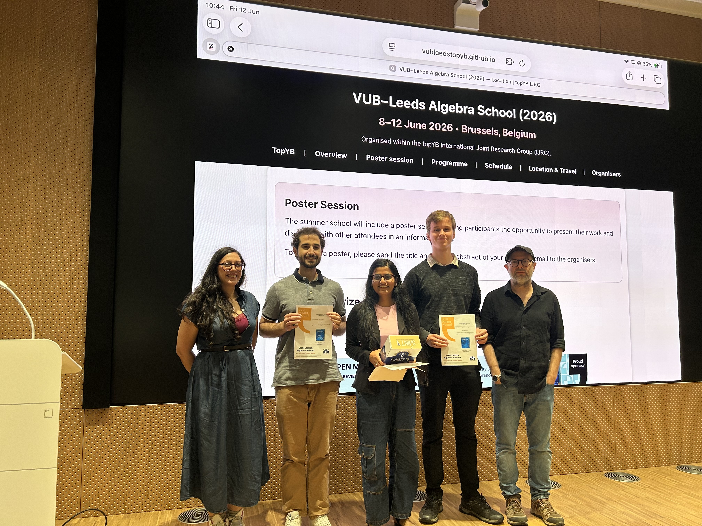

<section class="hero">
<h2>Poster Session</h2>

The summer school will include a poster session, giving participants the opportunity to present their work and discuss it with other attendees in an informal setting.

To present a poster, please send the title and a short abstract of your poster by email to the organisers.

</section>

## Best Poster Prize

<section>
  

    
  

  <h3>Winners</h3>
  <ul>
  <li>Deepanshi Saraf, <b>Bounded Cohomology of Algebraic Structures in Knot Theory</b></li>
  <li>Andrea Albano, <b>On the representation theory of skew braces</b></li>
  <li>Joachim Slembrouck, <b>When are non-associative algebras associative?</b></li>
  </ul>
</section>

 

<strong>Best poster prize supported by <em>Open Mathematics</em></strong>

